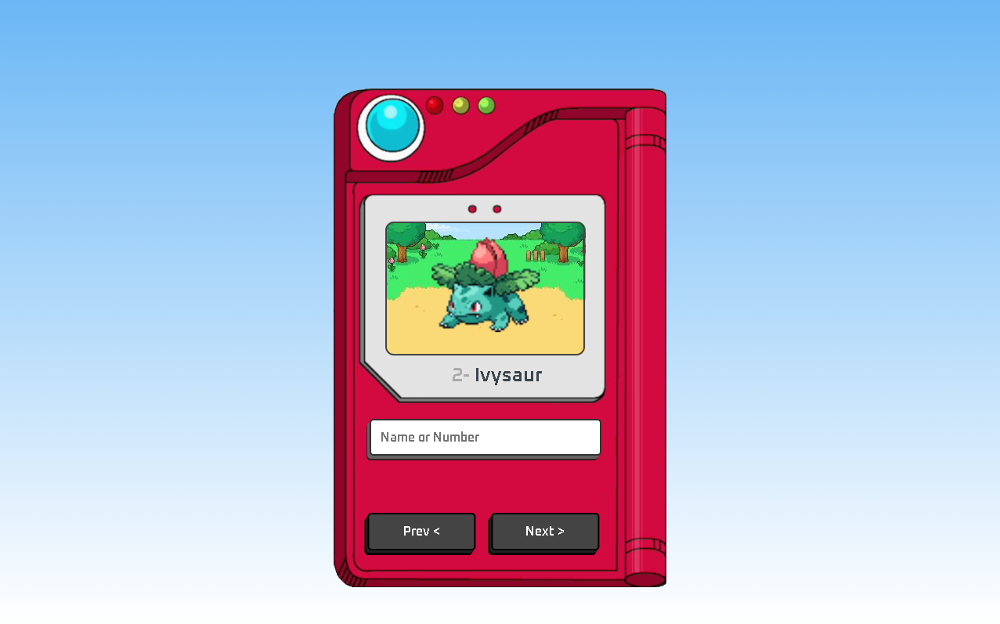

# 📱 Pokédex

<div align="center">


### 🔍 Explore o mundo Pokémon direto do navegador


</div>

---

## 🚀 Demonstração

🔗 **Live Preview:** [https://anaclarissi.github.io/pokedex/](https://anaclarissi.github.io/pokedex/)
💻 **Repositório:** [https://github.com/anaClarissi/pokedex](https://github.com/anaClarissi/pokedex)

---

## 📷 Preview

<div align="center">

</div>

---

## 🧠 Sobre o projeto

Esta Pokédex foi desenvolvida com o objetivo de praticar **consumo de APIs**, manipulação de DOM e lógica com JavaScript.

A aplicação permite buscar Pokémons dinamicamente utilizando a **PokeAPI**, exibindo nome, número e sprite animado diretamente na interface.

---

## ⚙️ Funcionalidades

* 🔍 Busca por **nome ou número**
* ⏮ Navegação para o Pokémon anterior
* ⏭ Navegação para o próximo Pokémon
* 🎞 Exibição de sprite animado
* ⚡ Consumo de dados em tempo real
* 🧠 Atualização dinâmica da interface

---

## 🛠 Tecnologias utilizadas

<div align="center">

| Tecnologia | Descrição                 |
| ---------- | ------------------------- |
| HTML5      | Estrutura da aplicação    |
| CSS3       | Estilização e layout      |
| JavaScript | Lógica e consumo da API   |
| REST API   | Comunicação com a PokeAPI |

</div>

---

## 🌐 API utilizada

Este projeto utiliza a incrível:

👉 [https://pokeapi.co/](https://pokeapi.co/)

Exemplo de endpoint usado:

```bash
https://pokeapi.co/api/v2/pokemon/1
```

---

## 📂 Estrutura do projeto

```bash
pokedex/
│
├── index.html
├── css/
│   └── style.css
├── js/
│   └── script.js
├── images/
│   ├── pokedex.png
│   └── preview.png
└── favicons/
```

---

## 🧩 Como funciona

1. O usuário digita o nome ou número do Pokémon
2. O JavaScript faz uma requisição para a API
3. Os dados são processados
4. A interface é atualizada dinamicamente

---

## 📦 Como rodar o projeto

```bash
# Clone o repositório
git clone https://github.com/anaClarissi/pokedex.git

# Acesse a pasta
cd pokedex

# Abra o index.html no navegador
```

---

## 🎓 Créditos

Projeto desenvolvido com base no tutorial de:

* 📺 Manual do Dev
* 🔗 [https://www.youtube.com/@ManualdoDev](https://www.youtube.com/@ManualdoDev)
* 💻 [https://github.com/manualdodev](https://github.com/manualdodev)

---

## 👩‍💻 Autora

Feito com 💙 por **Ana Clarissi**

🔗 LinkedIn: https://www.linkedin.com/in/anaclarissi

---

## 📌 Aprendizados

Durante este projeto, foram praticados:

* Manipulação de DOM
* Eventos em JavaScript
* Consumo de APIs
* Programação assíncrona (async/await)
* Organização de código

---

## ✨ Melhorias futuras

* [ ] Adicionar tipos e habilidades
* [ ] Mostrar stats (HP, ataque, defesa)
* [ ] Adicionar som dos Pokémons
* [ ] Melhorar responsividade
* [ ] Dark mode 🌙

---

## ⭐ Contribuição

Contribuições são bem-vindas!

1. Fork o projeto
2. Crie uma branch
3. Faça suas alterações
4. Envie um Pull Request

---

## 📄 Licença

Este projeto está sob a licença MIT.

---

<div align="center">

✨ Se gostou do projeto, deixe uma estrela! ✨

</div>